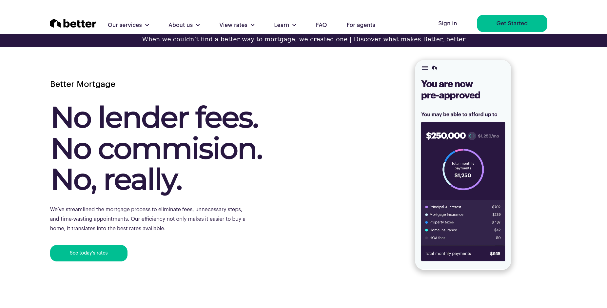

# Front-End Practice - Web Page Clone

This is a clone of the [Better Mortgage](https://better.com/) landing page. The project was built to practice my Front-End web development skills by cloning a live web page from the internet and reproduce it as closely as I could. 

## Overview

This is a practice project for my Front-End web development skills. The task is to try and build a clone of an existing web page and get it as close to the original as I can. Here goes nothing ☺.

### The challenge

To reproduce the landing page of the website as closely as possible and implement all the UI designs from scratch if possible. Hence the tasks can be broken down into:
- Inspecting the page and downloading any resources needed
- Searching for any fonts and icons used on the page or any free alternatives on the internet
- Making sure the colors and animations looks as close to and smooth as the original

### Screenshots

- Live Site URL: [Live Site on Netlify](https://wandonium-mortgage.netlify.app/)

## My process

Break the web page into parts e.g. navbar, showcase (part with mobile phone card) etc. Then build each part as a React component each with it's own styling in a separate css file. Then combine all the parts into one web page. This way any component can be reused to make other web pages.

### Built with

- ReactJS
- JSX: Html markup mixed in with javascript as per React Standards
- CSS custom properties
- Flexbox
- CSS Grid
- ES6 Javascript syntax

